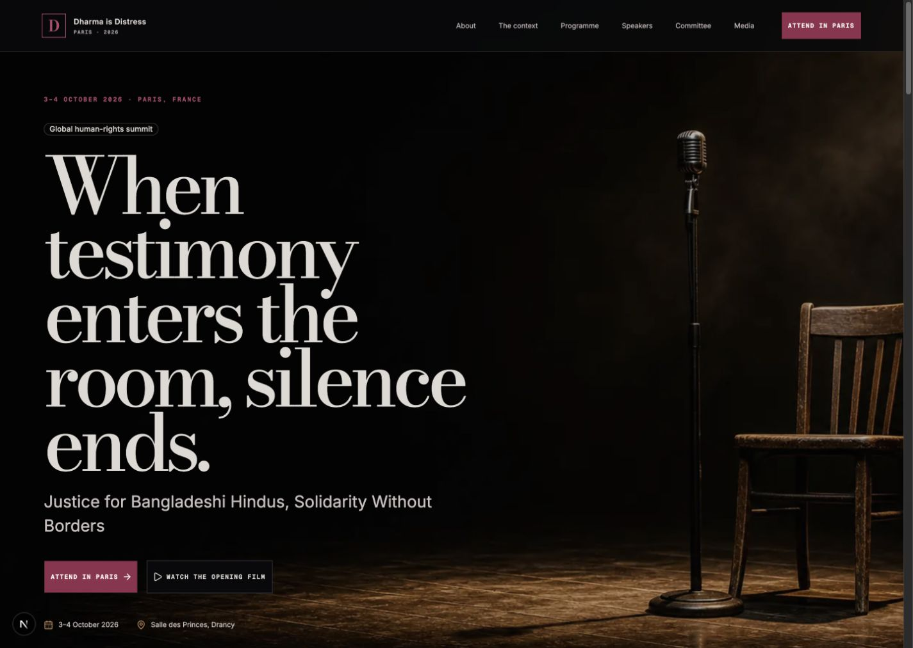
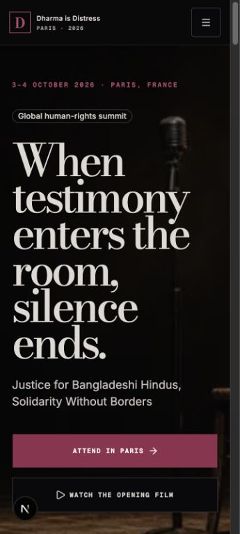

# Dharma is Distress · Paris 2026

Production-shaped, responsive website for the **Global Solidarity Summit for Bangladeshi Hindus**, taking place on **3–4 October 2026** at Salle des Princes in Drancy, Paris.

The visual system develops the client-selected **Design 09 · Night Testimony** direction: a near-black auditorium, warm stage light, restrained wine-red accents, editorial serif typography, and testimony-led storytelling.

## Preview





## Pages

| Route | Purpose |
| --- | --- |
| `/` | Summit overview, evidence, programme preview, speakers, countdown, and donation CTA |
| `/about` | Mission, principles, outcomes, and seven-point charter |
| `/context` | Historical, demographic, legal, and recent-incident context |
| `/programme` | Interactive two-day summit schedule |
| `/speakers` | Confirmed and proposed contributors |
| `/committee` | Organising committee and responsibilities |
| `/media` | Research, publication, documentary, press, and media resources |
| `/participate` | Registration, volunteering, sponsorship, media accreditation, contact, and donation |

## Functional prototype flows

- Responsive desktop and mobile navigation
- Tuned compact-phone, large-phone, tablet, small-laptop, and desktop layouts
- Two-day programme tabs
- Delegate registration form with a realistic success state
- Contact and participation entry points
- Donation dialog with selectable euro amounts, email validation, and a mock success state
- The payment flow is deliberately non-transactional; a production provider can be connected later without redesigning the entry flow
- Generated witness-flame favicon and Apple touch icon

## Local development

```bash
bun install
bun run dev
```

Open [http://localhost:3000](http://localhost:3000).

Quality checks:

```bash
bun run typecheck
bun run lint
bun run build
```

## Source material

The content architecture and factual event details were developed from the supplied summit documents in the parent folder, including `Paris Website.pdf`, the event concept note, the conference committee document, and the speaker/committee profiles.

Before publication, the organisers should approve final speaker status, programme timings, contact destinations, source links, privacy language, and the selected payment provider.

## Stack

- Next.js 16 App Router
- React 19
- TypeScript
- Tailwind CSS 4
- shadcn/ui with Base UI primitives
- Bun
